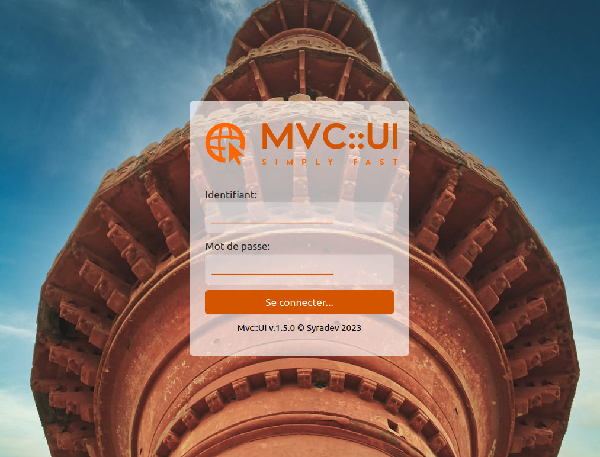

# MVC::UI
Une approche MVC simple construite avec PHP8.

Classe MvcUIController
=====================

La classe `MvcUIController` est la classe principale de l'interface utilisateur pour l'application `MvcUI`. Cette classe contient des méthodes pour instancier un objet `MvcUIController`, récupérer la configuration de l'application, renvoyer le chemin des actifs, mettre en cache les routes de l'application dans une session PHP, vérifier si une route existe, ou encore renvoyer le nom d'une route à partir de ses segments d'url.

Notice d'installation du package PHP Mvc::UI :
--------

1. Créez un domaine virtuel apache pointant vers un dossier local de vote disque dur.

2. Ajoutez votre domaine factice dans votre fichier hosts (c:\windows\system32\drivers\etc\hosts ou /etc/hosts).

3. Clonez le package Mvc::UI avec la command : 
<code>git clone https://github.com/Treedent/MVC-UI.git</code>.

4. Importez la base de données Northwind qui se trouve dans le dossier /public/assets/src/SQL en utilisant un outil de gestion de bases de données tel que phpMyAdmin. Si vous avez déjà la base de données Northwind, vous pouvez passer cette étape.

5. Éditez le fichier de configuration /conf/app.json pour paramétrer l'accès à la base de données. Il suffit de modifier les informations de votre serveur de base de données et les informations de connexion appropriées. Si vous avez choisi d'utiliser la base de données northwind, modifiez les paramètres de connexion pour correspondre à votre propre installation de la base de données.

6. Éditez le fichier de configuration /conf/app.json pour paramétrer votre domaine et votre url complète (originating_url) et votre clé d'encryptage (hmacData : 42 caractères conseillés).

7. Compilez les fichiers CSS, JS et généreez la documentation de vos classes depuis le dossier /scripts/*.vbs ou *.sh.

Le package Mvc::UI est maintenant installé et prêt à être utilisé. Il vous permettra de créer des interfaces utilisateur avancées pour votre application en utilisant une structure MVC (Modèle-Vue-Contrôleur). N'oubliez pas de consulter la documentation de classes fournie pour en apprendre davantage sur les fonctionnalités et l'utilisation de ce package.

Méthodes
--------

### `getInstance(): MvcUIController`

Cette méthode est utilisée pour instancier un objet `MvcUIController`. Elle renvoie une instance de la classe.

<code>$mvcUI = MvcUIController::getInstance();</code>

### `getConf($key = null)`

Cette méthode est utilisée pour récupérer la configuration de l'application. Elle prend un paramètre optionnel `$key` qui est le nom de la clé de configuration que l'on veut récupérer. Si `$key` est null, la méthode renvoie la configuration complète de l'application. Si `$key` est spécifié, la méthode renvoie la valeur de la clé de configuration correspondante.

### `assets($asset): string`

Cette méthode est utilisée pour renvoyer le chemin des actifs. Elle prend un paramètre `$asset` qui est le nom du fichier de l'actif. La méthode renvoie une chaîne de caractères représentant le chemin de l'actif.

### `cacheRoutes(): void`

Cette méthode est utilisée pour mettre en cache les routes de l'application dans une session PHP. Elle initialise la session PHP, si elle n'est pas déjà active et stocke les routes de l'application dans la variable de session `mvcRoutes`.

### `isRoute(string $routeName, bool|null $startBy = null): bool`

Cette méthode est utilisée pour vérifier si une route existe. Elle prend deux paramètres : `$routeName`, qui est le nom de la route à vérifier, et `$startBy` qui est une valeur booléenne optionnelle indiquant si la vérification doit être effectuée en utilisant `str_starts_with` plutôt que l'égalité stricte. Si `$startBy` est `true`, la méthode vérifie si la route actuelle commence par le chemin de la route spécifiée. Sinon, elle vérifie si la route actuelle correspond exactement au chemin de la route spécifiée.

### `getRouteName(string $requestedRoute): string`

Cette méthode est utilisée pour renvoyer le nom d'une route à partir de ses segments. Elle prend un paramètre `$requestedRoute` qui est le chemin de la route demandée. La méthode parcourt toutes les routes de l'application pour trouver celle qui correspond au chemin demandé et renvoie son nom. Si aucune route ne correspond, la méthode renvoie une chaîne vide.
